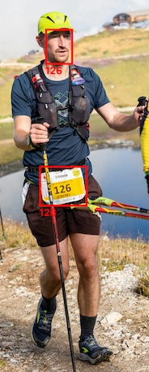

# runner-recognition

This project aims to recognize **runners** in competitions. My goal is to recognize runner with image processing.
Following this analysis, we import data in DB.

{ width=10% }

Runners wants to find there photos after competition. According to the bib number, we can find the runner. Photographers takes photos of runner but sometimes bib cannot been recognized due to shadows or bad light. So we use face recognition to recognize `unknown` runners.

## Introduction

This project aims to develop a system for recognizing runners in photos. It uses machine learning techniques to detect people in images, and then applies **optical character recognition (OCR)** to identify numbers on the runners clothing. The images of runners with recognized numbers are saved in a `pivot` directory, while images of runners without recognizable numbers are saved in an `unknown` directory. The project also saves images of the runners' faces in separate directories based on whether their corresponding images in the `pivot` or `unknown` directories have recognizable numbers.

## Imports

- We imports several packages, including `numpy`, `keras_ocr`, and `torch`, which are used for **image processing**, OCR, and **machine learning**, respectively.

## Finding Persons on images

```
The code iterates over the images in the "images" directory in the workspace. 
For each image : 
  Check if the image file name is already present in the "person" directory
  
  Identify people in the image using the person detection model 
  
  If people are detected: 
    Crop the image to include only the person and saves the cropped image in the "person" directory. 
```

## OCR on bibs images

```
The code iterates over the images in the "person" directory.

For each image : 
  Check if the image file name is already present in the "pivot" or "unknown" directories
  
  Recognize numbers in the image using the OCR pipeline 
  
  If a number is recognized: 
    Save the image in the "pivot" directory. 
  Otherwise: 
    Save the image in the "unknown" directory. 
```

## Finding Faces on pivot images

```
The code iterates over the images in the "pivot" directory.

For each image : 
  Check if the image file name is already present in the "face_pivot" directory
  
  Identify faces in the image using the face detection model 
  
  If faces are detected: 
    Crop the image to include only the face and saves the cropped image in the "face_pivot" directory. 
```



## Finding Faces on unknown images

```
The code iterates over the images in the "unknown" directory.

For each image : 
  Check if the image file name is already present in the "face_unknown" directory
  
  Identify faces in the image using the face detection model 
  
  If faces are detected: 
    Crop the image to include only the face and saves the cropped image in the "face_unknown" directory. 
```


## Matching pivot and unknown images

```
The code iterates over the images in the "pivot" directory.

For each face : 
  Check if the image file name is already present in the "face_pivot" directory
  
  Vectorize both faces in the pivot and unknown faces using the face vectorization model
  
  If match is detected: 
    Add unknown to pivot data.
```

## Exporting data

```
{
    "121": [
        "test_script/images/1#12-1-1032462109.jpg"
    ],
    "128": [
        "test_script/images/1#12-1-1032462109.jpg"
    ],
    "120": [
        "test_script/images/1#12-1-1032462109.jpg"
    ],
    "122": [
        "test_script/images/1#12-1-1032462109.jpg"
    ],
    "127": [
        "test_script/images/1#12-1-1032462109.jpg"
    ]
}
```